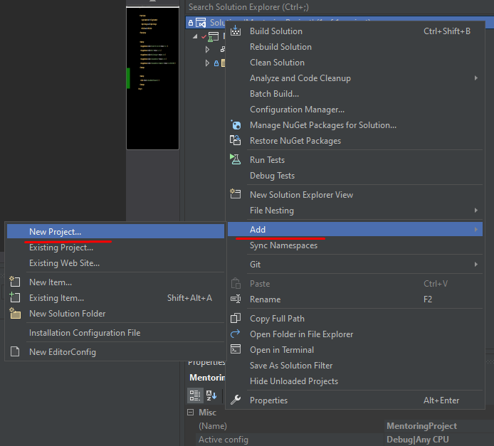
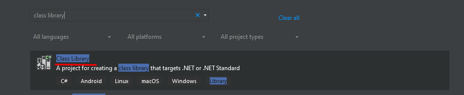
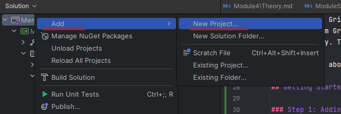
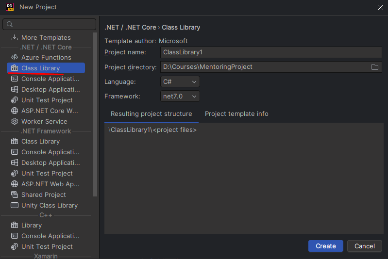
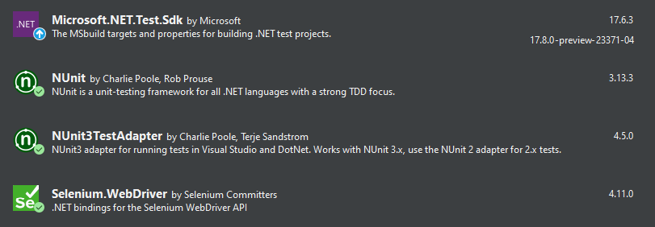
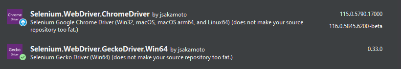

# Introduction to Selenium Automation Testing with C#

## What is Selenium?

Selenium is a powerful open-source automation testing framework primarily used for web application testing. 
It allows testers and developers to automate browser actions and interactions to validate the functionality of \
web applications across different browsers and operating systems.

### Selenium IDE, Selenium WebDriver, and Selenium Grid

Selenium consists of three main components, each serving a specific purpose:

1. **Selenium IDE (Integrated Development Environment):**
    - Selenium IDE is a browser plugin that allows users to record and playback interactions with the browser. 
It's easy to use, especially for beginners, and can generate test scripts in various programming languages, including C#.

2. **Selenium WebDriver:**
    - Selenium WebDriver provides a powerful and programmatic API for automating browser interactions. 
It allows developers to write test scripts in their preferred programming languages, such as C#, to perform complex 
actions and validations on web elements.

3. **Selenium Grid:**
    - Selenium Grid enables parallel test execution by distributing tests across multiple machines or browsers 
simultaneously. This is especially useful for speeding up the test execution process and achieving efficient cross-browser testing.

To learn more about Selenium's components in detail, you can refer to this article: 
[Selenium Components: IDE, WebDriver, and Grid](https://www.selenium.dev/documentation)

## Getting Started with Selenium WebDriver in C#

### Step 1: Adding a Class Library Project

First, create a new Class Library project in your C# solution to host your Selenium WebDriver tests.

#### Visual Studio
1. Right click on your solution in Solution Explorer > Add > New Project



2. Search Class Library project > Next
3. Set Project name > Next > Create



#### JetBrains Rider
1. Right click on your solution in Solution Explorer > Add > New Project



2. Select Class Library patter > Set Name > Create



### Step 2: Adding a Test Class

Add a new class to the project that will contain your test methods. In this example, 
let's name the class "SeleniumTests."

```csharp
using OpenQA.Selenium;

public class SeleniumTests {
}
```

### Step 3: Installing Required Packages (NuGet)

Before working with Selenium WebDriver, you need to install the necessary packages. In the NuGet Package Manager 
(Tools > NuGet Package Manager > Manage NuGet Packages for Solution), search for and install the following packages:

- Microsoft.NET.Test.Sdk
- NUnit
- NUnit3TestAdapter
- Selenium.WebDriver



#### Installing Chrome and Firefox Drivers

IWebDriver is an interface provided by Selenium WebDriver, which is a popular framework for automated testing
of web applications. In C#, you would use it to automate browser behavior. There are two ways how to install driver 
(Chrome/Firefox):

**1. NuGet Package (Preferable)**

Tools > NuGet Package Manager > Manage NuGet Packages for Solution > Search for one of the provided packages:
- Selenium.WebDriver.ChromeDriver (Chrome)
- Selenium.WebDriver.GeckoDriver (Firefox)




**2. Download Executables (Obsolete)**

##### Chrome Driver

1. Go to the [ChromeDriver download page](https://googlechromelabs.github.io/chrome-for-testing/).
2. Download the ChromeDriver executable that matches your installed Chrome browser version.
3. Extract the downloaded zip file and copy the chromedriver.exe to a location on your system.
4. In the test script, specify the path to the ChromeDriver executable when creating the ChromeDriver instance, like this:

### Firefox Driver (GeckoDriver)

1. Go to the [GeckoDriver download page](https://github.com/mozilla/geckodriver/releases). 
2. Download the GeckoDriver executable for your operating system. 
3. Extract the downloaded zip file and copy the geckodriver.exe (Windows) or geckodriver (Linux/macOS) to a location on your system. 
4. In the test script, specify the path to the GeckoDriver executable when creating the FirefoxDriver instance, like this:

### Step 4: Writing the First Test

In the "SeleniumTests" class, create a new test method and mark it with the **[Test]** attribute from NUnit.
In this example, we create a simple test class `SeleniumTestExample` that uses the Chrome browser. The test navigates
to "https://www.example.com" and retrieves the page title using `driver.Title`. It then uses NUnit's `Assert.AreEqual`
method to check if the actual title matches the expected value ("Example Domain"). If the assertion passes, the test
is considered successful.

```csharp
using NUnit.Framework;
using OpenQA.Selenium;
using OpenQA.Selenium.Chrome;

public class SeleniumTestExample {
    IWebDriver driver;

    [Test]
    public void TestWebsiteTitle() {
        // Set the path of the ChromeDriver executable
        var driver = new ChromeDriver();
        
        // Open the website
        driver.Navigate().GoToUrl("https://www.example.com");

        // Get the actual page title
        string pageTitle = driver.Title;

        // Assert the page title with the expected value
        Assert.AreEqual("Example Domain", pageTitle);

        // Find an element by its ID
        IWebElement elementById = driver.FindElement(By.Id("elementId"));
        // Click on the element
        elementById.Click();

        // Find an element by its name
        IWebElement elementByName = driver.FindElement(By.Name("elementName"));
        // Send keys to the element
        elementByName.SendKeys("Hello, Selenium!");

        // Find an element by its XPath
        IWebElement elementByXPath = driver.FindElement(By.XPath("//div[@class='example']"));
        // Get the visible text of the element
        string elementText = elementByXPath.Text;
        Assert.AreEqual("This is an example element.", elementText);

        // Close the browser
        driver.Quit();
    }
}
```

#### Creating the WebDriver Instance
In the test method "TestWebsiteTitle," we initialize the ChromeDriver instance using the ChromeOptions and navigate 
to the website under test. We then retrieve the page title using driver.Title and use NUnit's Assert.AreEqual method 
to check if the actual title matches the expected value ("Example Domain"). The driver is installed using NuGet Package

**NuGet Package**
```csharp
var driver = new ChromeDriver();
```

If you are using executables, your code will be like:

**Executables**
```csharp
var driver = new ChromeDriver("path/to/chromedriver.exe");
```

#### Interacting with Web Elements

To interact with web elements, such as buttons, forms, or links, you can use the following basic methods provided by 
Selenium WebDriver:

- `driver.FindElement(By locator)`: This method finds a single web element based on the specified locator 
(e.g., By.Id, By.Name, By.XPath).
```csharp
IWebElement element = driver.FindElement(By.Id("elementId"));
```

- `element.Click()`: This method simulates a mouse click on the element.
```csharp
element.Click();
```

- `element.SendKeys(string text)`: This method sends the specified text to the element, usually used for input fields.
```csharp
element.SendKeys("Hello, Selenium!");
```

- `element.Text`: This property retrieves the visible text of the element.
```csharp
string visibleText = element.Text;
```

More information about interacting with IWebElement you find [here](https://www.selenium.dev/documentation/webdriver/elements/interactions/)

#### Cleaning Up

We need to ensure that the browser is closed after each test

```csharp
driver.Quit();
```

Keep in mind that this is just a basic example, and Selenium provides many more features and functionalities 
for comprehensive web application testing.

Happy coding with Selenium in C#!

## Useful links
1. [Selenium WebDriver](https://www.selenium.dev/documentation/webdriver/) Documentation
1. [NUnit](https://docs.nunit.org/articles/nunit/getting-started/installation.html) Documentation
