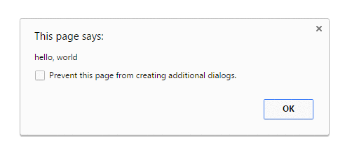
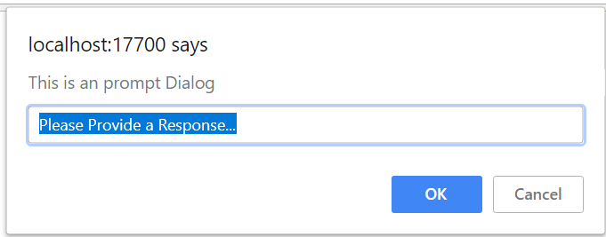
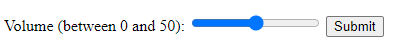

# Different Page Elements

In Selenium automation testing using C# and NUnit, you often need to interact with various page elements such as 
alerts, iframes, and more. This guide will provide you with a short theoretical overview and code examples on how 
to work with these elements effectively.

## Alert Handling

Alerts are commonly used for displaying messages or prompts on a webpage. Selenium provides methods to interact 
with alerts.

**Alert Types:**
- **Simple Alert:** A basic pop-up with a message and an "OK" button. 
```csharp
// Handling a simple alert
IAlert simpleAlert = driver.SwitchTo().Alert();

// Get the text from the alert
string alertText = simpleAlert.Text;

// Accept the alert
simpleAlert.Accept();
```

- **Confirmation Alert:** A pop-up with a message, along with "OK" and "Cancel" buttons.
```csharp
// Handling a confirmation alert
IAlert confirmationAlert = driver.SwitchTo().Alert();
confirmationAlert.Accept(); // Clicks "OK"
// OR
confirmationAlert.Dismiss(); // Clicks "Cancel"
```

- **Prompt Alert:** A pop-up with a message, an input field, and "OK" and "Cancel" buttons.
```csharp
// Handling a prompt alert
IAlert promptAlert = driver.SwitchTo().Alert();
promptAlert.SendKeys("Your input");
promptAlert.Accept();
// OR
promptAlert.Dismiss();
```


## IFrames

```html
<iframe src="https://www.w3schools.com" title="W3Schools Free Online Web Tutorials"></iframe>
```
iframes (inline frames) allow you to embed another HTML document within the current document. Selenium provides methods 
to switch to and interact with iframes using locators.

Switching to an Iframe:
- Use `SwitchTo().Frame()` method to switch the context to the desired iframe using a locator.
- Use `SwitchTo().DefaultContent()` to switch back to the main content.

### Code Example:

```csharp
using OpenQA.Selenium;
using NUnit.Framework;

// ...

// Find the iframe element by its locator
IWebElement iframeElement = driver.FindElement(By.CssSelector("iframe#iframeId"));

// Switch to the iframe
driver.SwitchTo().Frame(iframeElement);

// Perform actions within the iframe
// ...

// Switch back to the main content
driver.SwitchTo().DefaultContent();
```

## Interacting with Select, Checkbox, Range, and Input Elements

Selenium provides various methods to interact with different HTML elements like selects, checkboxes, range inputs, 
and text inputs.

### Select Element:

```html
<select name="cars" id="cars">
    <option value="volvo">Volvo</option>
    <option value="saab">Saab</option>
    <option value="opel">Opel</option>
    <option value="audi">Audi</option>
</select>
```

- Use `SelectElement` class to interact with `<select>` elements.
```csharp
// Interacting with a select element
SelectElement select = new SelectElement(driver.FindElement(By.Id("selectElementId")));
select.SelectByText("Option Text");
```
- Use `select.SelectedOption.Text` to get selected value.

```csharp
// Getting the selected value from a select element
string selectedOption = select.SelectedOption.Text;
```

### Checkbox Element:

```html
<input type="checkbox" id="vehicle1" name="vehicle1" value="Bike">
```

- Use `IWebElement.Click()` to toggle checkboxes
```csharp
// Interacting with a checkbox
IWebElement checkbox = driver.FindElement(By.Id("checkboxElementId"));
checkbox.Click();
```
- Use `IWebElement.Selected` to verify whether checkbox is checked
```csharp
// Checking if a checkbox is checked
bool isChecked = checkbox.Selected;
```

### Range Element:

```html
<input type="range" id="vol" name="vol" min="0" max="50">
```


- Use `IWebElement.SendKeys()` or `IWebElement.SetAttribute("value", "new value")`
```csharp
IWebElement rangeInput = driver.FindElement(By.Id("rangeInputElementId"));
rangeInput.SendKeys(Keys.Home + "50"); // Sets value to 50
```
- Use `IWebElement.GetAttribute("value")` to get range value
```csharp
// Getting the value of a range input
string rangeValue = rangeInput.GetAttribute("value");
```

### Text Element

```html
<input type="text" id="fname" name="fname">
```

- Use `IWebElement.SendKeys()` to input text
```csharp
// Interacting with a text input
IWebElement textInput = driver.FindElement(By.Id("textInputElementId"));
textInput.SendKeys("Text to input");
```
- Use `IWebElement.GetAttribute("value")` to get text input value
```csharp
// Getting the value of a text input
string inputValue = textInput.GetAttribute("value");
```
- Use `IWebElement.Clear()` to clear input value
```csharp
// Clearing the value of a text input
textInput.Clear();
```
